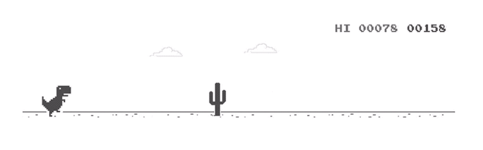

## Hi, I'm Ahmed -> ( Web & Mobile & AI ) App Developer ♣

## Languages & Tools 💼

## Find me around the web 
 - [linkedIn](https://www.linkedin.com/in/ahmed-Ashraf-Dev) Account
 - [Mostaql](https://mostaql.com/u/Ahmed_FoR3oN) Account
 - [Email](mailto:Ahmed.Ashraf.Dv@gmail.com) address
 - And of course GitHub you're already on
 
 ## Stats 📈
 |  |   |
| ------------- | ------------- |
